# Dokumentasi UML — SI Pengelolaan Data Agenda

Dokumen ini berisi diagram UML (Use Case, Sequence, Activity, Robustness, dan Class) untuk sistem **SI Pengelolaan Data Agenda**, aplikasi berbasis **Laravel 12 + Vue 3 (PWA)** untuk mengelola surat, disposisi, kegiatan, kehadiran, dan pengingat.

## Ringkasan Sistem

- **Login** menggunakan email + password (session-based).
- **Role**: `Admin`, `Staff`, `Asisten Daerah`, `OPD`.
- Saat **Staff** membuat **Surat**, sistem otomatis:
  1. Membuat **Disposisi** dengan keterangan `diterima` (tanpa perlu diedit), dan
  2. Membuat **Pengingat** untuk seluruh akun **Asisten Daerah**.
- Saat salah satu role menambah **Kegiatan**, sistem otomatis membuat **Pengingat** untuk **semua role**.
- Saat menambah **Kegiatan**, sistem otomatis melakukan **Cek Bentrok Jadwal**: jika sudah ada kegiatan lain pada tanggal dan jam yang sama, pembuatan kegiatan ditolak.
- Hanya **OPD** yang dapat melakukan **Konfirmasi Kehadiran** kegiatan (`hadir` / `tidak`), tercatat per akun OPD. Role lain dapat melihat rekap dan daftar OPD yang mengonfirmasi.
- **Disposisi** dapat **Diserahkan** atau **Ditolak** (wajib alasan) oleh Asisten Daerah. Saat **Diserahkan**, Asisten Daerah wajib mengisi **Penerima** (`tandatangan_penerima`) dan **Dituju** (`tandatangan_dituju`). Sistem otomatis membuat **Pengingat** untuk seluruh akun **Staff**.
- **Staff hanya dapat melihat Disposisi**: tidak dapat mengubah, menyerahkan/menolak, maupun menghapus. Hanya **Asisten Daerah** yang dapat menyerahkan/menolak; tidak ada role yang dapat menghapus disposisi.
- **Lonceng Notifikasi Pengingat** tersedia di header untuk role Staff, Asisten Daerah, dan OPD.
- Notifikasi **Real-Time** (via **Laravel Reverb** + **Laravel Echo**) hanya aktif untuk pengingat yang dibuat otomatis dari form **Tambah Surat** (`source = surat`), **Tambah Kegiatan** (`source = kegiatan`), dan aksi **Menyerahkan/Menolak Disposisi** (`source = disposisi`). Pengingat yang dibuat manual tidak memicu notifikasi.
- Setiap pengingat otomatis dilengkapi status **dibaca / belum dibaca** (`read_at`) dan dapat ditandai dibaca per item atau semuanya.

## Aktor

| Aktor | Deskripsi |
|-------|-----------|
| **Admin** | Mengelola pengguna & role. Tidak memiliki akses pengingat/notifikasi. |
| **Staff** | Mengelola surat dan kegiatan, melihat disposisi, dan mengelola pengingat pribadi; menerima notifikasi pengingat real-time. |
| **Asisten Daerah** | Meninjau disposisi (menyerahkan/menolak), mengelola pengingat pribadi, dan menerima notifikasi pengingat real-time. |
| **OPD** | Mengonfirmasi kehadiran kegiatan, mengelola pengingat pribadi, dan menerima notifikasi pengingat real-time. |

## Kebutuhan Fungsional Sistem

| Kode | Kebutuhan Fungsional | Deskripsi | Aktor |
|------|----------------------|-----------|-------|
| FR-01 | Login & Logout | Autentikasi pengguna menggunakan email + password (session-based) beserta logout. | Admin, Staff, Asisten Daerah, OPD |
| FR-02 | Dashboard | Menampilkan statistik Disposisi (Total, Diterima, Ditolak, Diserahkan), statistik Kegiatan (Total, Terlaksana, Tidak), dan rekap Kegiatan per Periode. | Admin, Staff, Asisten Daerah, OPD |
| FR-03 | Kelola Surat | Membuat, mengubah, dan menghapus surat. Saat surat baru dibuat, sistem otomatis membuat **Disposisi** (status Diterima) dan **Pengingat** untuk seluruh Asisten Daerah. | Staff |
| FR-04 | Lihat Disposisi | Melihat daftar dan detail disposisi beserta status dan alasan. | Staff, Asisten Daerah |
| FR-05 | Serahkan Disposisi | Menyerahkan disposisi disertai **Penerima** (`tandatangan_penerima`) dan **Dituju** (`tandatangan_dituju`) tanpa alasan. Sistem otomatis membuat Pengingat ke seluruh Staff. | Asisten Daerah |
| FR-06 | Tolak Disposisi | Menolak disposisi disertai **Alasan** (wajib). Sistem otomatis membuat Pengingat ke seluruh Staff. | Asisten Daerah |
| FR-07 | Kelola Kegiatan | Membuat, mengubah, dan menghapus kegiatan dengan **Cek Bentrok Jadwal** otomatis (menolak jika tanggal & jam sama). Sistem otomatis membuat Pengingat ke semua role. | Staff |
| FR-08 | Konfirmasi Kehadiran | Mengonfirmasi kehadiran kegiatan (**Hadir** / **Tidak**) yang tercatat per akun OPD dan dapat diubah. | OPD |
| FR-09 | Lihat Rekap & Daftar OPD | Melihat rekap jumlah hadir/tidak dan daftar OPD yang mengonfirmasi kehadiran suatu kegiatan. | Staff, Asisten Daerah |
| FR-10 | Kelola Pengingat Pribadi | Membuat, mengubah, menghapus, dan menandai selesai pengingat milik sendiri. | Staff, Asisten Daerah, OPD |
| FR-11 | Notifikasi Pengingat Real-Time | Menerima notifikasi real-time (badge belum dibaca) saat surat/kegiatan/disposisi dibuat atau diubah, serta menandai dibaca per item atau semuanya. | Staff, Asisten Daerah, OPD |
| FR-12 | Kelola Pengguna & Role | Mengelola akun pengguna dan role. | Admin |

---

## 1. Use Case Diagram

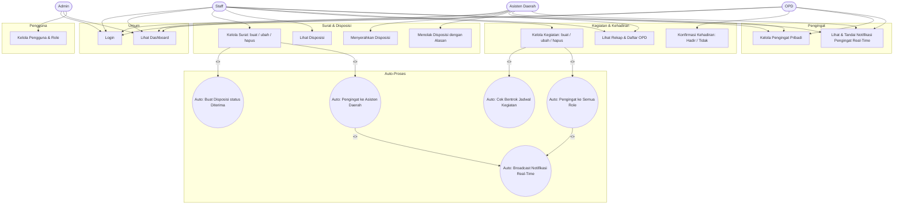

> Catatan: `<<include>>` menandai proses tambahan yang dijalankan otomatis oleh sistem setelah aksi utama.

### 1.1 Use Case — Login dan Dashboard

Use case berikut memfokuskan pada dua fungsionalitas yang diakses oleh **semua role** (Admin, Staff, Asisten Daerah, OPD): **Login/Logout** dan **Dashboard**.

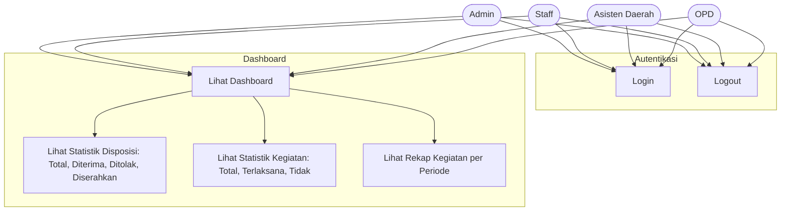

---

## 2. Sequence Diagram

### 2.1 Login (Autentikasi Pengguna)

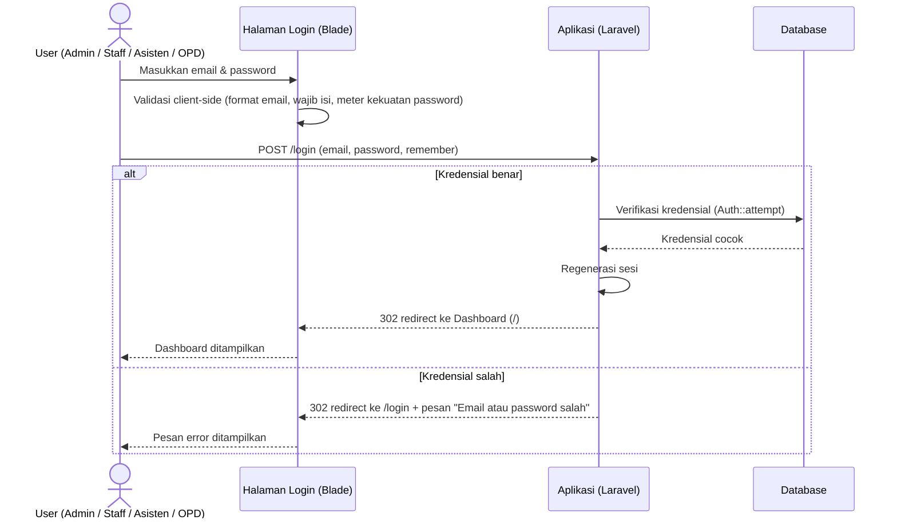

### 2.2 Dashboard (Melihat Statistik Disposisi & Kegiatan)

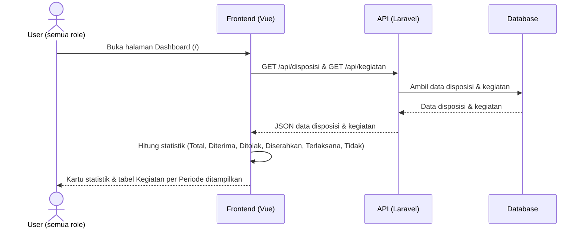

### 2.3 Staff Membuat Surat → Auto Disposisi (Diterima) & Pengingat Asisten Daerah

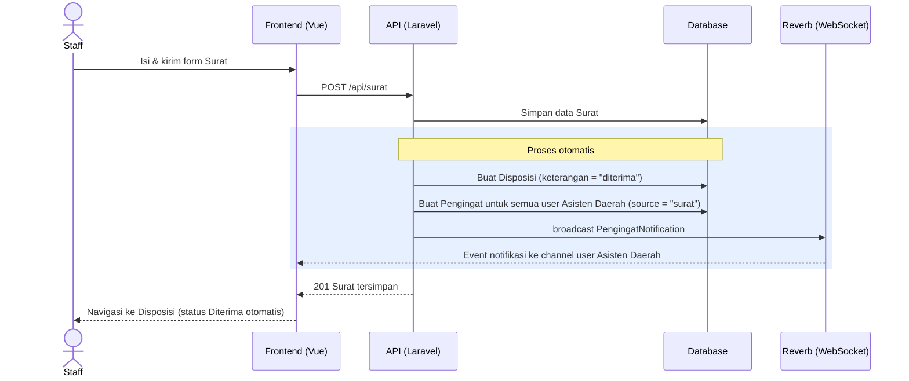

### 2.4 Asisten Daerah Meninjau Disposisi (Serahkan / Tolak) → Pengingat Staff

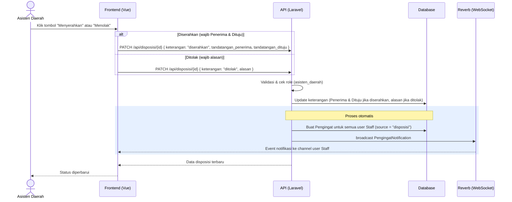

### 2.5 Staff (atau Role Lain) Menambah Kegiatan → Auto Cek Jadwal & Pengingat Semua Role

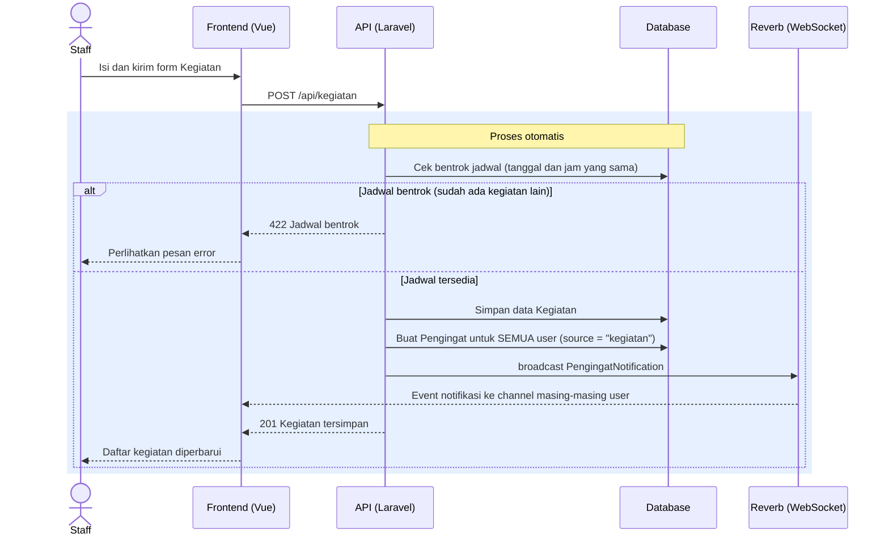

### 2.6 OPD Konfirmasi Kehadiran Kegiatan

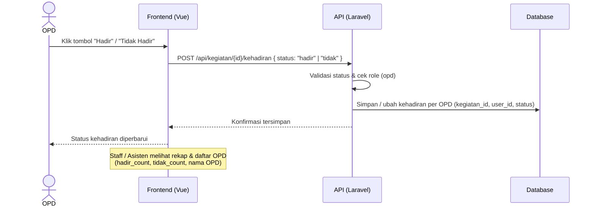

### 2.7 Notifikasi Pengingat Real-Time (Lonceng Notifikasi)

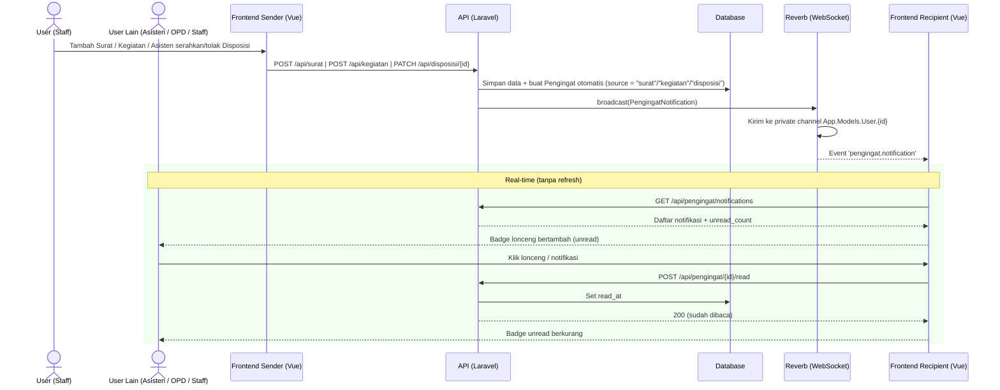

---

## 3. Activity Diagram

### 3.1 Alur Login

```mermaid
swimlane-beta LR
  subgraph User
    A([Mulai])
    B[Buka halaman /login]
    C[Isi email & password]
    D{Validasi form client-side}
    E[Tampilkan pesan error per field]
    H[Tampilkan pesan Email atau password salah]
    K([Selesai])
  end
  subgraph Sistem
    F[Terima POST /login]
    G{Kredensial valid?}
    I[Regenerasi sesi]
    J[Redirect ke Dashboard /]
  end
  A --> B
  B --> C
  C --> D
  D -- Tidak valid --> E
  E --> C
  D -- Valid --> F
  F --> G
  G -- Tidak --> H
  H --> C
  G -- Ya --> I
  I --> J
  J --> K
```

### 3.2 Alur Menampilkan Dashboard

```mermaid
swimlane-beta LR
  subgraph User
    A([Mulai])
    B[Login berhasil]
    C[Buka halaman Dashboard /]
    F[Tampilkan pesan Gagal memuat statistik]
    G[Tampilkan kartu statistik]
    H[Tampilkan tabel Kegiatan per Periode]
    I([Selesai])
  end
  subgraph Sistem
    D[Muat halaman Dashboard]
    E[Ambil data disposisi & kegiatan]
    J{Data berhasil dimuat?}
    K[Hitung statistik disposisi & kegiatan]
  end
  A --> B
  B --> C
  C --> D
  D --> E
  E --> J
  J -- Tidak --> F
  F --> I
  J -- Ya --> K
  K --> G
  G --> H
  H --> I
```

### 3.3 Alur Pengelolaan Surat → Disposisi

```mermaid
swimlane-beta LR
  subgraph Staff
    A([Mulai])
    B[Input data Surat]
  end
  subgraph Sistem
    C[Simpan Surat]
    D[Auto: Buat Disposisi status Diterima]
    E[Auto: Buat Pengingat ke Asisten Daerah]
    H[Set status Disposisi: Diserahkan]
    J[Set status Disposisi: Ditolak + Alasan]
  end
  subgraph Asisten [Asisten Daerah]
    F[Tinjau Disposisi]
    G{Disetujui?}
    I[Isi alasan penolakan]
    K([Selesai])
  end
  A --> B
  B --> C
  C --> D
  D --> E
  E --> F
  F --> G
  G -- Ya --> H
  G -- Tidak --> I
  I --> J
  H --> K
  J --> K
```

### 3.4 Alur Konfirmasi Kehadiran Kegiatan (OPD)

```mermaid
swimlane-beta LR
  subgraph OPD
    A([Mulai])
    B[Buka halaman Kegiatan]
    C{Memilih status kehadiran}
    D[Kirim konfirmasi hadir]
    E[Kirim konfirmasi tidak]
  end
  subgraph Sistem
    F[Simpan konfirmasi per OPD]
  end
  subgraph RoleLain [Role Lain]
    G[Lihat rekap & daftar OPD]
    H([Selesai])
  end
  A --> B
  B --> C
  C -- Hadir --> D
  C -- Tidak Hadir --> E
  D --> F
  E --> F
  F --> G
  G --> H
```

### 3.5 Alur Menambah Kegiatan dengan Auto Cek Bentrok Jadwal

```mermaid
swimlane-beta LR
  subgraph Staff
    A([Mulai])
    B[Input data Kegiatan]
    C[Tampilkan pesan: Jadwal bentrok]
    D([Selesai])
  end
  subgraph Sistem
    E{Auto cek bentrok jadwal}
    F[Tolak pembuatan kegiatan]
    G[Simpan data Kegiatan]
    H[Auto: Pengingat ke semua role]
  end
  A --> B
  B --> E
  E -- Bentrok pada tanggal dan jam yang sama --> F
  F --> C
  E -- Tersedia --> G
  G --> H
  C --> D
  H --> D
```

### 3.6 Alur Notifikasi Pengingat Real-Time

```mermaid
swimlane-beta LR
  subgraph User
    A([Mulai])
    B[Tambah Surat / Kegiatan]
  end
  subgraph Sistem
    C[Simpan data]
    D[Auto: Buat Pengingat ke user lain]
    E{Broadcast event ke Reverb?}
    J[Tandai notifikasi dibaca read_at]
  end
  subgraph UserLain [User Lain]
    F[Terima event real-time]
    G[Buka notifikasi via GET saat dibuka]
    H[Lonceng bertambah dengan badge unread]
    I{User mengklik lonceng / notifikasi?}
    K[Membuka halaman Pengingat]
    L[Badge unread berkurang]
    M([Selesai])
  end
  A --> B
  B --> C
  C --> D
  D --> E
  E -- Berhasil --> F
  E -- Gagal / koneksi mati --> G
  F --> H
  G --> H
  H --> I
  I -- Ya --> K
  K --> J
  J --> L
  I -- Tidak --> L
  L --> M
```

---

## 4. Robustness Diagram

Robustness diagram memodelkan hubungan antar tiga jenis objek yang saling berinteraksi dalam setiap alur: **Boundary** (antarmuka pengguna), **Controller** (logika aplikasi), dan **Entity** (data/model). Diagram ini digunakan untuk memastikan setiap use case dapat dipetakan ke antarmuka, kontrol, dan data yang sesuai.

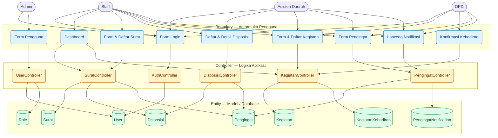

---

## 5. Class Diagram

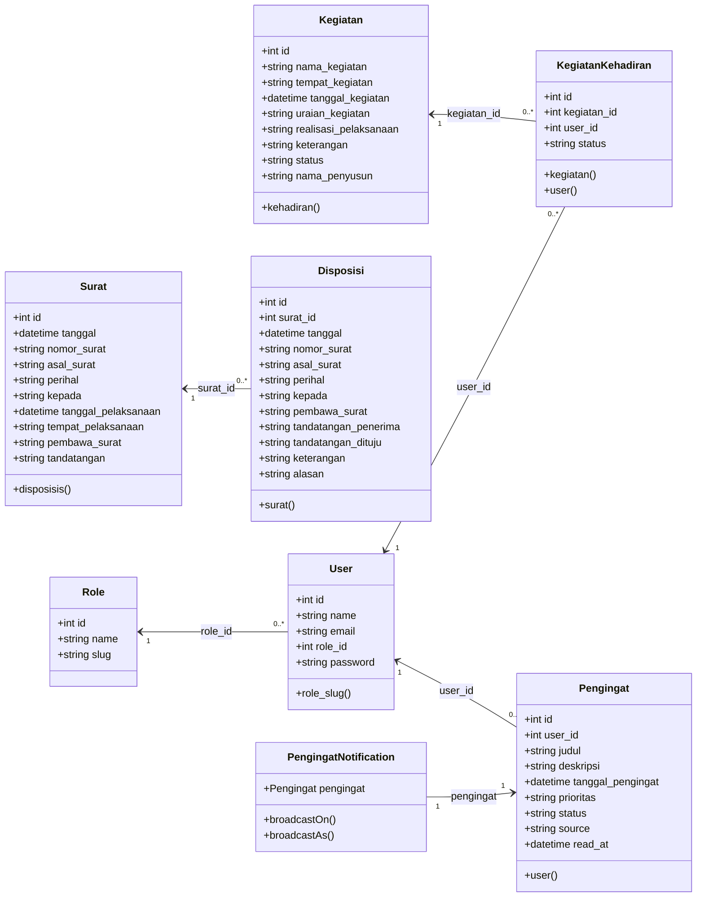

### Nilai Enum / Status

| Atribut | Nilai |
|---------|-------|
| `Disposisi.keterangan` | `diterima`, `ditolak`, `diserahkan` |
| `Kegiatan.realisasi_pelaksanaan` | `terlaksana`, `tidak` |
| `Kegiatan.status` | `pelaksanaan`, `laporan` |
| `KegiatanKehadiran.status` | `hadir`, `tidak` |
| `Pengingat.prioritas` | `rendah`, `sedang`, `tinggi` |
| `Pengingat.status` | `pending`, `selesai` |
| `Pengingat.source` | `manual`, `surat`, `kegiatan` |
| `Pengingat.read_at` | `null` (belum dibaca), timestamp (dibaca) |

---

## 6. Skenario Pengujian API — Response Berhasil / Gagal

Tabel berikut memetakan setiap use case ke skenario pengujian beserta kode **response HTTP** yang dikembalikan sistem, baik pada kondisi **berhasil** maupun **gagal**. Endpoint API mengembalikan format JSON; endpoint web (login/logout) mengembalikan redirect.

> **Keterangan status:** `200` sukses dengan data, `201` sukses buat data baru, `204` sukses hapus tanpa konten, `302` redirect, `401` belum login, `403` role tidak berhak, `404` data tidak ditemukan, `422` validasi gagal.

### 6.1 Login & Dashboard

| ID | Skenario | Kondisi | Request | Response | Hasil |
|----|----------|---------|---------|----------|-------|
| A-01 | Membuka halaman login | Guest | `GET /login` | `200` | **Berhasil** — form login ditampilkan |
| A-02 | Login | Email & password benar | `POST /login` | `302` | **Berhasil** — redirect ke `/` |
| A-03 | Login | Email/password salah | `POST /login` | `302` + error | **Gagal** — pesan "Email atau password salah" |
| A-04 | Login | Input tidak valid / password lemah | `POST /login` | `302` + error validasi | **Gagal** — error validasi email & kekuatan password |
| A-05 | Login (ingat saya) | Ceklis "remember me" | `POST /login` | `302` + cookie `remember_web_*` | **Berhasil** — sesi diingat |
| A-06 | Logout | User terautentikasi | `POST /logout` | `302` | **Berhasil** — redirect ke `/login` |
| A-07 | Logout | Guest | `POST /logout` | `302` | **Gagal** — redirect ke `/login` |
| A-08 | Akses dashboard `/` | Guest | `GET /` | `302` | **Gagal** — redirect ke `/login` |
| A-09 | Akses dashboard `/` | User terautentikasi | `GET /` | `200` | **Berhasil** — dashboard tampil |

### 6.2 Kelola Surat

| ID | Skenario | Kondisi / Data | Request | Response | Hasil |
|----|----------|-----------------|---------|----------|-------|
| S-01 | Lihat daftar surat | Terautentikasi | `GET /api/surat` | `200` | **Berhasil** — array surat |
| S-02 | Lihat daftar surat | Guest | `GET /api/surat` | `401` | **Gagal** — belum login |
| S-03 | Buat surat | Data valid | `POST /api/surat` | `201` | **Berhasil** — surat tersimpan; auto buat **Disposisi (diterima)** & **Pengingat** ke semua Asisten Daerah |
| S-04 | Buat surat | Field wajib kosong / tanggal tidak valid | `POST /api/surat` | `422` | **Gagal** — error validasi |
| S-05 | Detail surat | Data tersedia | `GET /api/surat/{id}` | `200` | **Berhasil** — data surat |
| S-06 | Detail surat | Data tidak ditemukan | `GET /api/surat/999` | `404` | **Gagal** — surat tidak ada |
| S-07 | Ubah surat | Data valid | `PUT /api/surat/{id}` | `200` | **Berhasil** — data terupdate |
| S-08 | Ubah surat | Field tidak valid | `PUT /api/surat/{id}` | `422` | **Gagal** — error validasi |
| S-09 | Hapus surat | Data tersedia | `DELETE /api/surat/{id}` | `204` | **Berhasil** — data terhapus (tanpa konten) |

### 6.3 Kelola Disposisi (Lihat / Serahkan / Tolak)

| ID | Skenario | Kondisi / Data | Request | Response | Hasil |
|----|----------|-----------------|---------|----------|-------|
| D-01 | Lihat daftar disposisi | Terautentikasi | `GET /api/disposisi` | `200` | **Berhasil** — array disposisi |
| D-02 | Lihat disposisi per surat | Filter `?surat_id=` | `GET /api/disposisi?surat_id=5` | `200` | **Berhasil** — hasil terfilter |
| D-03 | Detail disposisi | Data tersedia | `GET /api/disposisi/{id}` | `200` | **Berhasil** — data + relasi surat |
| D-04 | Detail disposisi | Data tidak ditemukan | `GET /api/disposisi/999` | `404` | **Gagal** — disposisi tidak ada |
| D-05 | Staff ubah disposisi | Bukan role asisten | `PUT /api/disposisi/{id}` | `403` | **Gagal** — staff tidak memiliki akses mengubah |
| D-06 | Staff serahkan/tolak | Bukan role asisten | `PUT /api/disposisi/{id}` | `403` | **Gagal** — staff tidak memiliki akses |
| D-07 | Staff/Asisten hapus | Route tidak terdaftar | `DELETE /api/disposisi/{id}` | `405` | **Gagal** — method tidak diizinkan |
| D-08 | Asisten **menyerahkan** | `keterangan = diserahkan` + `tandatangan_penerima` + `tandatangan_dituju` | `PUT /api/disposisi/{id}` | `200` | **Berhasil** — status Diserahkan + Penerima/Dituju tersimpan + **Pengingat otomatis ke seluruh Staff** |
| D-09 | Asisten **menolak** | `keterangan = ditolak` + `alasan` | `PUT /api/disposisi/{id}` | `200` | **Berhasil** — status Ditolak + alasan + **Pengingat otomatis ke seluruh Staff** |
| D-10 | Asisten menolak | Tanpa `alasan` | `PUT /api/disposisi/{id}` | `422` | **Gagal** — alasan wajib diisi saat ditolak |
| D-10a | Asisten **menyerahkan** | Tanpa `tandatangan_penerima`/`tandatangan_dituju` | `PUT /api/disposisi/{id}` | `422` | **Gagal** — Penerima & Dituju wajib diisi saat diserahkan |
| D-11 | Asisten memakai field staff | `keterangan = diterima` | `PUT /api/disposisi/{id}` | `422` | **Gagal** — tidak diizinkan untuk role asisten |
| D-12 | Role lain (OPD) ubah | Bukan asisten | `PUT /api/disposisi/{id}` | `403` | **Gagal** — tidak memiliki akses |

### 6.4 Kelola Kegiatan (Buat / Ubah / Hapus) + Auto Cek Bentrok Jadwal

| ID | Skenario | Kondisi / Data | Request | Response | Hasil |
|----|----------|-----------------|---------|----------|-------|
| K-01 | Lihat daftar kegiatan | Semua role | `GET /api/kegiatan` | `200` | **Berhasil** — daftar + `hadir_count`/`tidak_count` |
| K-02 | Detail kegiatan | Data tersedia | `GET /api/kegiatan/{id}` | `200` | **Berhasil** — data kegiatan |
| K-03 | Detail kegiatan | Data tidak ditemukan | `GET /api/kegiatan/999` | `404` | **Gagal** — kegiatan tidak ada |
| K-04 | **Buat** kegiatan | Staff, jadwal tersedia | `POST /api/kegiatan` | `201` | **Berhasil** — kegiatan tersimpan; auto **Pengingat** ke semua role |
| K-05 | **Buat** kegiatan | Jadwal **bentrok** (tanggal+jam sama) | `POST /api/kegiatan` | `422` | **Gagal** — "Sudah ada kegiatan pada tanggal dan jam tersebut." |
| K-06 | **Buat** kegiatan | Field wajib kosong / tidak valid | `POST /api/kegiatan` | `422` | **Gagal** — error validasi |
| K-07 | **Buat** kegiatan | Role bukan staff (OPD) | `POST /api/kegiatan` | `403` | **Gagal** — tidak memiliki akses |
| K-08 | **Ubah** kegiatan | Staff, jadwal tersedia | `PUT /api/kegiatan/{id}` | `200` | **Berhasil** — data terupdate |
| K-09 | **Ubah** kegiatan | Mengubah ke jadwal **bentrok** | `PUT /api/kegiatan/{id}` | `422` | **Gagal** — jadwal bentrok |
| K-10 | **Ubah** kegiatan | Mempertahankan jadwal sendiri | `PUT /api/kegiatan/{id}` | `200` | **Berhasil** — tidak dianggap bentrok |
| K-11 | **Ubah** kegiatan | Role bukan staff | `PUT /api/kegiatan/{id}` | `403` | **Gagal** — tidak memiliki akses |
| K-12 | **Hapus** kegiatan | Staff | `DELETE /api/kegiatan/{id}` | `204` | **Berhasil** — data terhapus |
| K-13 | **Hapus** kegiatan | Role bukan staff | `DELETE /api/kegiatan/{id}` | `403` | **Gagal** — tidak memiliki akses |

### 6.5 Konfirmasi Kehadiran (OPD)

| ID | Skenario | Kondisi / Data | Request | Response | Hasil |
|----|----------|-----------------|---------|----------|-------|
| H-01 | Konfirmasi **hadir** | Role OPD, `status = hadir` | `POST /api/kegiatan/{id}/kehadiran` | `200` | **Berhasil** — tercatat per akun OPD |
| H-02 | Konfirmasi **tidak hadir** | Role OPD, `status = tidak` | `POST /api/kegiatan/{id}/kehadiran` | `200` | **Berhasil** — status diperbarui |
| H-03 | Ubah konfirmasi | OPD konfirmasi ulang | `POST /api/kegiatan/{id}/kehadiran` | `200` | **Berhasil** — record di-update (bukan duplikat) |
| H-04 | Konfirmasi | `status` tidak valid (bukan hadir/tidak) | `POST /api/kegiatan/{id}/kehadiran` | `422` | **Gagal** — error validasi |
| H-05 | Konfirmasi | Role bukan OPD (staff) | `POST /api/kegiatan/{id}/kehadiran` | `403` | **Gagal** — tidak memiliki akses |
| H-06 | Konfirmasi | Kegiatan tidak ditemukan | `POST /api/kegiatan/999/kehadiran` | `404` | **Gagal** — kegiatan tidak ada |

### 6.6 Kelola Pengingat Pribadi (Staff / Asisten Daerah / OPD)

| ID | Skenario | Kondisi / Data | Request | Response | Hasil |
|----|----------|-----------------|---------|----------|-------|
| P-01 | Lihat daftar pengingat | User melihat data miliknya | `GET /api/pengingat` | `200` | **Berhasil** — hanya pengingat milik sendiri |
| P-02 | Buat pengingat | Data valid | `POST /api/pengingat` | `201` | **Berhasil** — pengingat tersimpan |
| P-03 | Buat pengingat | Field wajib kosong / prioritas tidak valid | `POST /api/pengingat` | `422` | **Gagal** — error validasi |
| P-04 | Detail pengingat | Milik user yang sama | `GET /api/pengingat/{id}` | `200` | **Berhasil** — data pengingat |
| P-05 | Detail pengingat | Milik user lain | `GET /api/pengingat/{id}` | `404` | **Gagal** — diperlakukan sebagai tidak ditemukan |
| P-06 | Ubah pengingat | Milik user yang sama | `PUT /api/pengingat/{id}` | `200` | **Berhasil** — data terupdate |
| P-07 | Ubah pengingat | Milik user lain | `PUT /api/pengingat/{id}` | `404` | **Gagal** — diperlakukan sebagai tidak ditemukan |
| P-08 | Ubah pengingat | Data tidak valid | `PUT /api/pengingat/{id}` | `422` | **Gagal** — error validasi |
| P-09 | Hapus pengingat | Milik user yang sama | `DELETE /api/pengingat/{id}` | `204` | **Berhasil** — data terhapus |
| P-10 | Hapus pengingat | Milik user lain | `DELETE /api/pengingat/{id}` | `404` | **Gagal** — diperlakukan sebagai tidak ditemukan |
| P-11 | Akses pengingat | Role Admin | `GET /api/pengingat` | `403` | **Gagal** — admin tidak diperbolehkan |

### 6.8 Notifikasi Pengingat Real-Time

| ID | Skenario Uji | Kondisi | Endpoint | Status | Hasil |
|----|--------------|---------|----------|--------|-------|
| N-01 | Lihat notifikasi | Terautentikasi | `GET /api/pengingat/notifications` | `200` | **Berhasil** — hanya `source = surat/kegiatan` + `unread_count` |
| N-02 | Tandai notifikasi dibaca | Milik user yang sama | `POST /api/pengingat/{id}/read` | `200` | **Berhasil** — `read_at` terisi |
| N-03 | Tandai notifikasi dibaca | Milik user lain | `POST /api/pengingat/{id}/read` | `404` | **Gagal** — diperlakukan sebagai tidak ditemukan |
| N-04 | Tandai semua notifikasi dibaca | Terautentikasi | `POST /api/pengingat/read-all` | `200` | **Berhasil** — semua `read_at` terisi |
| N-05 | Akses notifikasi | Role Admin | `GET /api/pengingat/notifications` | `403` | **Gagal** — admin tidak diperbolehkan |

### 6.7 Kelola Pengguna & Role (Admin)

| ID | Skenario | Kondisi / Data | Request | Response | Hasil |
|----|----------|-----------------|---------|----------|-------|
| U-01 | Lihat daftar user | Role Admin | `GET /api/users` | `200` | **Berhasil** — daftar user + role |
| U-02 | Buat user | Data valid (password kuat) | `POST /api/users` | `201` | **Berhasil** — user tersimpan |
| U-03 | Buat user | Email sudah terpakai | `POST /api/users` | `422` | **Gagal** — email duplikat |
| U-04 | Buat user | Password lemah | `POST /api/users` | `422` | **Gagal** — password tidak memenuhi syarat |
| U-05 | Detail user | Data tersedia | `GET /api/users/{id}` | `200` | **Berhasil** — data user |
| U-06 | Detail user | Data tidak ditemukan | `GET /api/users/999` | `404` | **Gagal** — user tidak ada |
| U-07 | Ubah user | Data valid | `PUT /api/users/{id}` | `200` | **Berhasil** — data terupdate |
| U-08 | Ubah user | Data tidak valid / role tidak ada | `PUT /api/users/{id}` | `422` | **Gagal** — error validasi |
| U-09 | Hapus user | Menghapus user lain | `DELETE /api/users/{id}` | `204` | **Berhasil** — data terhapus |
| U-10 | Hapus user | Menghapus **akun sendiri** | `DELETE /api/users/{id}` | `422` | **Gagal** — tidak dapat menghapus akun sendiri |
| U-11 | Kelola user | Role bukan Admin (staff) | `GET /api/users` | `403` | **Gagal** — tidak memiliki akses |
| U-12 | Lihat daftar role | Role Admin | `GET /api/roles` | `200` | **Berhasil** — daftar role |
| U-13 | Lihat daftar role | Role bukan Admin | `GET /api/roles` | `403` | **Gagal** — tidak memiliki akses |

---

## 7. Skenario User Acceptance Test (UAT)

Bagian ini berisi skenario **User Acceptance Test (UAT)** berbasis skenario yang dijalankan oleh pengguna akhir untuk memvalidasi fungsionalitas sistem sesuai kebutuhan. Setiap skenario memuat langkah pengujian dan hasil yang diharapkan; kolom **Hasil Aktual** dan **Status** diisi oleh penguji (pengguna) selama uji penerimaan.

> **Skala Status:** `Lulus` (sesuai harapan) / `Gagal` (tidak sesuai harapan).

### 7.1 Login & Dashboard

| ID | Skenario Uji | Langkah / Input | Hasil yang Diharapkan | Hasil Aktual | Status |
|----|--------------|-----------------|----------------------|--------------|--------|
| UAT-01 | Membuka halaman login | Buka URL `/login` sebagai pengguna belum login | Form login (email, password, ingat saya) ditampilkan | | |
| UAT-02 | Login berhasil | Isi email & password akun yang terdaftar, klik **Login** | Redirect ke Dashboard `/`, sesi aktif | | |
| UAT-03 | Login gagal (kredensial salah) | Isi email/password salah | Pesan **"Email atau password salah"** ditampilkan, tetap di halaman login | | |
| UAT-04 | Validasi form saat mengetik | Kosongkan email / isi email tidak valid | Error per field ditampilkan real-time, tombol login diblokir | | |
| UAT-05 | Indikator kekuatan password | Ketik password lemah / kuat pada form login | Meter kekuatan password & daftar aturan muncul secara real-time | | |
| UAT-06 | Ingat saya | Centang **Ingat saya**, login, tutup browser, buka kembali | Sesi tetap diingat (login otomatis) | | |
| UAT-07 | Logout | Klik ikon logout di header | Sesi berakhir, redirect ke `/login` | | |
| UAT-08 | Dashboard tampil | Login dengan role apa pun, buka `/` | Kartu statistik Disposisi & Kegiatan serta tabel **Kegiatan per Periode** tampil | | |
| UAT-09 | Statistik disposisi akurat | Bandingkan angka Total/Diterima/Ditolak/Diserahkan dengan data | Jumlah sesuai data di halaman Disposisi | | |
| UAT-10 | Statistik kegiatan akurat | Bandingkan angka Total/Dilaksanakan/Tidak Dilaksanakan dengan data | Jumlah sesuai data di halaman Kegiatan | | |
| UAT-11 | Akses halaman tanpa login | Buka `/` tanpa autentikasi | Redirect ke `/login` | | |

### 7.2 Kelola Surat (Staff)

| ID | Skenario Uji | Langkah / Input | Hasil yang Diharapkan | Hasil Aktual | Status |
|----|--------------|-----------------|----------------------|--------------|--------|
| UAT-12 | Lihat daftar surat | Login sebagai **Staff**, buka menu **Surat** | Daftar surat ditampilkan | | |
| UAT-13 | Tambah surat | Isi form surat (valid), klik **Simpan** | Surat tersimpan, **otomatis** dibuat Disposisi status **Diterima** & Pengingat untuk Asisten Daerah, redirect ke Disposisi | | |
| UAT-14 | Tambah surat (field wajib kosong) | Kosongkan field wajib | Pesan error validasi ditampilkan, data tidak tersimpan | | |
| UAT-15 | Ubah surat | Ubah data surat, klik **Simpan** | Data terupdate, toast **berhasil** | | |
| UAT-16 | Hapus surat | Klik **Hapus**, konfirmasi pada dialog | Data terhapus, toast **berhasil** | | |
| UAT-17 | Hak akses surat | Login sebagai role **selain Staff**, buka menu Surat | Menu Surat tidak tersedia | | |

### 7.3 Kelola Disposisi (Staff / Asisten Daerah)

| ID | Skenario Uji | Langkah / Input | Hasil yang Diharapkan | Hasil Aktual | Status |
|----|--------------|-----------------|----------------------|--------------|--------|
| UAT-18 | Lihat daftar disposisi | Login sebagai Staff/Asisten, buka menu **Disposisi** | Daftar disposisi (beserta status & alasan) ditampilkan | | |
| UAT-19 | Staff tidak dapat mengubah disposisi | Staff membuka data disposisi | Tombol **Edit**/aksi ubah tidak tersedia untuk Staff | | |
| UAT-20 | Serahkan disposisi (Asisten) | Asisten klik **Menyerahkan**, isi **Penerima** & **Dituju**, simpan | Status menjadi **Diserahkan** + Penerima/Dituju tersimpan + notifikasi otomatis ke Staff | | |
| UAT-20a | Serahkan tanpa Penerima/Dituju | Asisten klik **Menyerahkan** tanpa mengisi Penerima/Dituju | Form menyerahkan (wajib Penerima & Dituju), simpan diblokir dengan error | | |
| UAT-21 | Tolak disposisi tanpa alasan | Asisten klik **Menolak** tanpa mengisi alasan | Form menolak (wajib alasan), simpan diblokir dengan error | | |
| UAT-22 | Tolak disposisi dengan alasan | Asisten klik **Menolak**, isi alasan, simpan | Status menjadi **Ditolak** + alasan tersimpan | | |
| UAT-23 | Tidak ada aksi hapus disposisi | Staff/Asisten mencari tombol **Hapus** pada disposisi | Aksi hapus tidak tersedia untuk semua role | | |
| UAT-24 | Asisten menyerahkan/menolak tanpa kewenangan lain | Asisten mencoba mengubah field data surat lain | Hanya status serahkan/tolak (dan Penerima/Dituju/Alasan) yang dapat diubah | | |

### 7.4 Kelola Kegiatan & Konfirmasi Kehadiran

| ID | Skenario Uji | Langkah / Input | Hasil yang Diharapkan | Hasil Aktual | Status |
|----|--------------|-----------------|----------------------|--------------|--------|
| UAT-25 | Lihat daftar kegiatan | Login sebagai Staff/Asisten/OPD, buka menu **Kegiatan** | Daftar kegiatan + rekap hadir/tidak ditampilkan | | |
| UAT-26 | Tambah kegiatan (jadwal kosong) | Staff isi form kegiatan, klik **Simpan** | Kegiatan tersimpan, **otomatis** dibuat Pengingat untuk semua role | | |
| UAT-27 | Tambah kegiatan (jadwal bentrok) | Staff isi kegiatan pada tanggal+jam yang sudah ada | Kegiatan **ditolak**, pesan **"Jadwal bentrok"** ditampilkan | | |
| UAT-28 | Ubah kegiatan | Staff ubah data kegiatan, simpan | Data terupdate; jika bentrok, ditolak | | |
| UAT-29 | Hapus kegiatan | Staff klik **Hapus**, konfirmasi | Data terhapus | | |
| UAT-30 | Konfirmasi hadir (OPD) | OPD klik **Hadir** pada kegiatan | Kehadiran tercatat per akun OPD, dapat diubah | | |
| UAT-31 | Konfirmasi tidak hadir (OPD) | OPD klik **Tidak Hadir** | Status kehadiran diperbarui | | |
| UAT-32 | Lihat daftar OPD | Staff/Asisten buka **Daftar OPD** pada kegiatan | Daftar OPD yang mengonfirmasi hadir/tidak tampil | | |
| UAT-33 | Role non-staff menambah kegiatan | OPD/Asisten mencoba tambah kegiatan | Tombol tambah/edit/hapus tidak tersedia | | |

### 7.5 Kelola Pengingat (Staff / Asisten Daerah / OPD)

| ID | Skenario Uji | Langkah / Input | Hasil yang Diharapkan | Hasil Aktual | Status |
|----|--------------|-----------------|----------------------|--------------|--------|
| UAT-34 | Lihat pengingat milik sendiri | Login, buka menu **Pengingat** | Hanya pengingat milik akun sendiri yang tampil | | |
| UAT-35 | Tambah pengingat | Isi judul, tanggal, prioritas, klik **Simpan** | Pengingat tersimpan | | |
| UAT-36 | Ubah pengingat | Ubah data pengingat, simpan | Data terupdate | | |
| UAT-37 | Hapus pengingat | Klik **Hapus**, konfirmasi | Data terhapus | | |
| UAT-38 | Pengingat milik user lain | Buka/ubah/hapus pengingat milik user lain | Diperlakukan sebagai tidak ditemukan (ditolak) | | |

### 7.6 Kelola Pengguna (Admin)

| ID | Skenario Uji | Langkah / Input | Hasil yang Diharapkan | Hasil Aktual | Status |
|----|--------------|-----------------|----------------------|--------------|--------|
| UAT-39 | Lihat daftar pengguna | Login sebagai **Admin**, buka menu **Pengguna** | Daftar pengguna + role ditampilkan | | |
| UAT-40 | Tambah pengguna | Isi data valid (password kuat), klik **Simpan** | Pengguna tersimpan | | |
| UAT-41 | Tambah pengguna (email duplikat) | Isi email yang sudah terpakai | Pesan error email duplikat, data tidak tersimpan | | |
| UAT-42 | Tambah pengguna (password lemah) | Isi password lemah | Error validasi & indikator kekuatan password ditampilkan | | |
| UAT-43 | Ubah pengguna | Ubah nama/email/role/password, simpan | Data terupdate | | |
| UAT-44 | Hapus pengguna lain | Hapus akun selain akun sendiri | Data terhapus | | |
| UAT-45 | Hapus akun sendiri | Coba hapus akun yang sedang login | Ditolak, pesan tidak dapat menghapus akun sendiri | | |
| UAT-46 | Hak akses pengguna | Login sebagai role selain Admin, buka menu **Pengguna** | Menu Pengguna tidak tersedia | | |

### 7.7 Notifikasi Pengingat Real-Time (Staff / Asisten Daerah / OPD)

| ID | Skenario Uji | Langkah / Input | Hasil yang Diharapkan | Hasil Aktual | Status |
|----|--------------|-----------------|----------------------|--------------|--------|
| UAT-47 | Lonceng notifikasi tampil | Login sebagai Staff/Asisten/OPD | Ikon lonceng **Notifikasi Pengingat** tampil di header (tidak tampil untuk Admin) | | |
| UAT-48 | Notifikasi real-time dari **Tambah Surat** | Staff menambah Surat; periksa akun **Asisten Daerah** pada tab lain (tanpa refresh) | Lonceng bertambah **real-time** dengan badge jumlah belum dibaca | | |
| UAT-49 | Notifikasi real-time dari **Tambah Kegiatan** | Staff menambah Kegiatan; periksa akun lain pada tab lain (tanpa refresh) | Lonceng bertambah **real-time** dengan badge jumlah belum dibaca | | |
| UAT-49a | Notifikasi real-time saat **Disposisi diserahkan/ditolak** | Asisten Daerah menyerahkan/menolak disposisi; periksa akun **Staff** pada tab lain (tanpa refresh) | Lonceng bertambah **real-time** dengan badge jumlah belum dibaca | | |
| UAT-50 | Pengingat manual tidak memicu notifikasi | User menambah Pengingat manual pada halaman Pengingat | Tidak ada lonceng/badge baru (sumber `manual` tidak dinotifikasikan) | | |
| UAT-51 | Buka daftar notifikasi | Klik lonceng notifikasi | Dropdown berisi daftar notifikasi (label **Surat/Kegiatan/Disposisi**, waktu relatif, tanggal pengingat) | | |
| UAT-52 | Baca satu notifikasi | Klik salah satu notifikasi di dropdown | Navigasi ke halaman **Pengingat**, badge unread berkurang satu | | |
| UAT-53 | Tandai semua dibaca | Klik **Tandai semua dibaca** pada dropdown | Semua notifikasi berstatus dibaca, badge hilang, toast **berhasil** | | |
| UAT-54 | Hak akses notifikasi | Login sebagai **Admin**, lihat header | Lonceng notifikasi tidak tersedia | | |

## 8. Blackbox Testing

Pengujian blackbox dilakukan terhadap **fungsi sistem** tanpa memperhatikan struktur internal kode. Setiap skenario memetakan **Kebutuhan Fungsional (FR)** ke **Skenario Uji**, **Langkah / Input**, dan **Hasil yang Diharapkan**; kolom **Hasil Aktual** dan **Status** diisi oleh penguji.

> **Skala Status:** `Lulus` (sesuai harapan) / `Gagal` (tidak sesuai harapan).

| ID | Kebutuhan Fungsional | Skenario Uji | Langkah / Input | Hasil yang Diharapkan | Hasil Aktual | Status |
|----|----------------------|--------------|-----------------|----------------------|--------------|--------|
| BB-01 | FR-01 | Login berhasil | Isi email & password valid, klik **Login** | Redirect ke Dashboard `/`, sesi aktif | | |
| BB-02 | FR-01 | Login gagal (kredensial salah) | Isi email/password salah | Pesan "Email atau password salah", tetap di halaman login | | |
| BB-03 | FR-01 | Login tanpa input | Kosongkan field email/password | Error validasi per field, login diblokir | | |
| BB-04 | FR-01 | Logout | Klik ikon logout di header | Sesi berakhir, redirect ke `/login` | | |
| BB-05 | FR-02 | Dashboard tampil | Login dengan role apa pun, buka `/` | Kartu statistik Disposisi & Kegiatan serta tabel **Kegiatan per Periode** tampil | | |
| BB-06 | FR-03 | Tambah surat (valid) | Staff isi form surat valid, klik **Simpan** | Surat tersimpan; otomatis dibuat **Disposisi (Diterima)** & **Pengingat** ke Asisten Daerah | | |
| BB-07 | FR-03 | Tambah surat (field wajib kosong) | Staff kosongkan field wajib | Pesan error validasi, data tidak tersimpan | | |
| BB-08 | FR-03 | Ubah surat | Staff ubah data surat, klik **Simpan** | Data terupdate, toast **berhasil** | | |
| BB-09 | FR-03 | Hapus surat | Staff klik **Hapus**, konfirmasi pada dialog | Data terhapus, toast **berhasil** | | |
| BB-10 | FR-03 | Hak akses surat | Login sebagai role selain Staff, buka menu Surat | Menu Surat tidak tersedia | | |
| BB-11 | FR-04 | Lihat daftar disposisi | Login sebagai Staff/Asisten, buka menu **Disposisi** | Daftar disposisi (status & alasan) ditampilkan | | |
| BB-12 | FR-04 | Staff tidak dapat mengubah disposisi | Staff membuka data disposisi | Tombol **Edit**/aksi ubah tidak tersedia untuk Staff | | |
| BB-13 | FR-05 | Serahkan disposisi | Asisten klik **Menyerahkan**, isi **Penerima** & **Dituju**, simpan | Status menjadi **Diserahkan** + Penerima/Dituju tersimpan + Pengingat otomatis ke Staff | | |
| BB-14 | FR-05 | Serahkan tanpa Penerima/Dituju | Asisten klik **Menyerahkan** tanpa mengisi Penerima/Dituju | Form menyerahkan (wajib Penerima & Dituju), simpan diblokir | | |
| BB-15 | FR-06 | Tolak disposisi dengan alasan | Asisten klik **Menolak**, isi alasan, simpan | Status menjadi **Ditolak** + alasan tersimpan + Pengingat otomatis ke Staff | | |
| BB-16 | FR-06 | Tolak tanpa alasan | Asisten klik **Menolak** tanpa mengisi alasan | Form menolak (wajib alasan), simpan diblokir | | |
| BB-17 | FR-06 | Tidak ada aksi hapus disposisi | Staff/Asisten mencari tombol **Hapus** pada disposisi | Aksi hapus tidak tersedia untuk semua role | | |
| BB-18 | FR-07 | Tambah kegiatan (jadwal kosong) | Staff isi form kegiatan valid, klik **Simpan** | Kegiatan tersimpan; otomatis dibuat Pengingat ke semua role | | |
| BB-19 | FR-07 | Tambah kegiatan (jadwal bentrok) | Staff isi kegiatan pada tanggal+jam yang sama dengan kegiatan lain | Kegiatan ditolak, pesan **"Jadwal bentrok"** ditampilkan | | |
| BB-20 | FR-07 | Ubah kegiatan | Staff ubah data kegiatan, simpan | Data terupdate; jika bentrok, ditolak | | |
| BB-21 | FR-07 | Hapus kegiatan | Staff klik **Hapus**, konfirmasi | Data terhapus | | |
| BB-22 | FR-07 | Hak akses kegiatan | OPD/Asisten mencoba tambah kegiatan | Tombol tambah/edit/hapus tidak tersedia | | |
| BB-23 | FR-08 | Konfirmasi hadir | OPD klik **Hadir** pada kegiatan | Kehadiran tercatat per akun OPD, dapat diubah | | |
| BB-24 | FR-08 | Konfirmasi tidak hadir | OPD klik **Tidak Hadir** | Status kehadiran diperbarui | | |
| BB-25 | FR-08 | Ubah konfirmasi | OPD konfirmasi ulang pada kegiatan yang sama | Record kehadiran di-update | | |
| BB-26 | FR-08 | Hak akses konfirmasi | Role selain OPD mencoba konfirmasi kehadiran | Aksi konfirmasi tidak tersedia/ditolak | | |
| BB-27 | FR-09 | Lihat rekap & daftar OPD | Staff/Asisten buka **Daftar OPD** pada kegiatan | Rekap hadir/tidak serta daftar OPD yang mengonfirmasi tampil | | |
| BB-28 | FR-10 | Tambah pengingat | Isi judul, tanggal, prioritas, klik **Simpan** | Pengingat tersimpan | | |
| BB-29 | FR-10 | Ubah pengingat | Ubah data pengingat, simpan | Data terupdate | | |
| BB-30 | FR-10 | Hapus pengingat | Klik **Hapus**, konfirmasi | Data terhapus | | |
| BB-31 | FR-10 | Pengingat milik user lain | Buka/ubah/hapus pengingat milik user lain | Diperlakukan sebagai tidak ditemukan (ditolak) | | |
| BB-32 | FR-11 | Notifikasi real-time dari **Tambah Surat** | Staff menambah Surat; periksa akun Asisten Daerah pada tab lain (tanpa refresh) | Lonceng bertambah **real-time** dengan badge jumlah belum dibaca | | |
| BB-33 | FR-11 | Notifikasi real-time dari **Tambah Kegiatan** | Staff menambah Kegiatan; periksa akun lain pada tab lain (tanpa refresh) | Lonceng bertambah **real-time** dengan badge jumlah belum dibaca | | |
| BB-34 | FR-11 | Notifikasi real-time saat **Disposisi diserahkan/ditolak** | Asisten menyerahkan/menolak disposisi; periksa akun Staff pada tab lain (tanpa refresh) | Lonceng bertambah **real-time** dengan badge jumlah belum dibaca | | |
| BB-35 | FR-11 | Tandai notifikasi dibaca | Klik salah satu notifikasi di dropdown | Navigasi ke halaman **Pengingat**, badge unread berkurang satu | | |
| BB-36 | FR-11 | Tandai semua dibaca | Klik **Tandai semua dibaca** pada dropdown | Semua notifikasi berstatus dibaca, badge hilang | | |
| BB-37 | FR-11 | Hak akses notifikasi | Login sebagai **Admin**, lihat header | Lonceng notifikasi tidak tersedia | | |
| BB-38 | FR-12 | Tambah pengguna (valid) | Admin isi data valid (password kuat), klik **Simpan** | Pengguna tersimpan | | |
| BB-39 | FR-12 | Tambah pengguna (email duplikat) | Isi email yang sudah terpakai | Pesan error email duplikat, data tidak tersimpan | | |
| BB-40 | FR-12 | Tambah pengguna (password lemah) | Isi password lemah | Error validasi & indikator kekuatan password ditampilkan | | |
| BB-41 | FR-12 | Hapus akun sendiri | Coba hapus akun yang sedang login | Ditolak, pesan tidak dapat menghapus akun sendiri | | |
| BB-42 | FR-12 | Hak akses pengguna | Login sebagai role selain Admin, buka menu **Pengguna** | Menu Pengguna tidak tersedia | | |