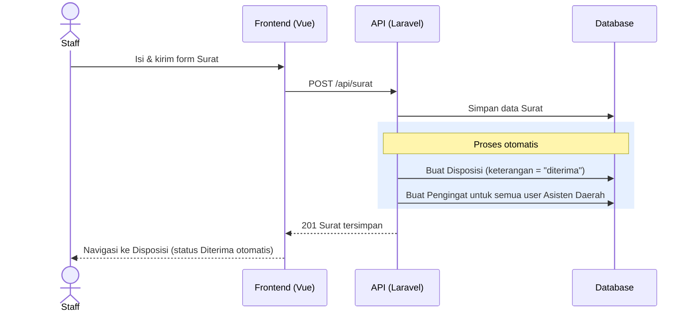
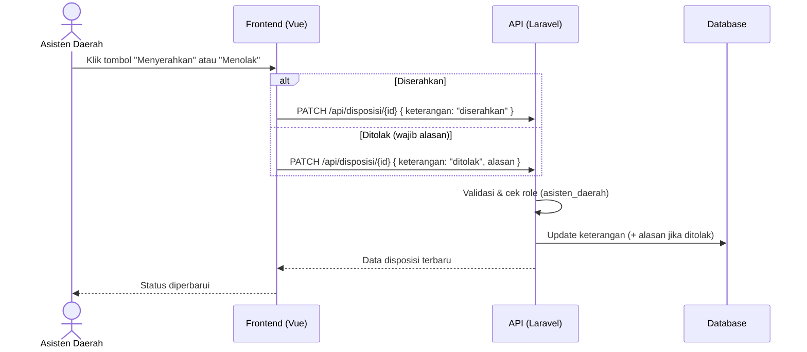
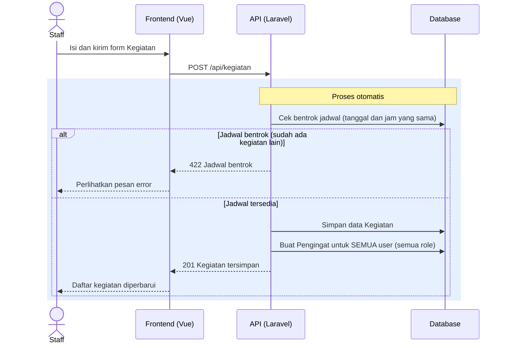
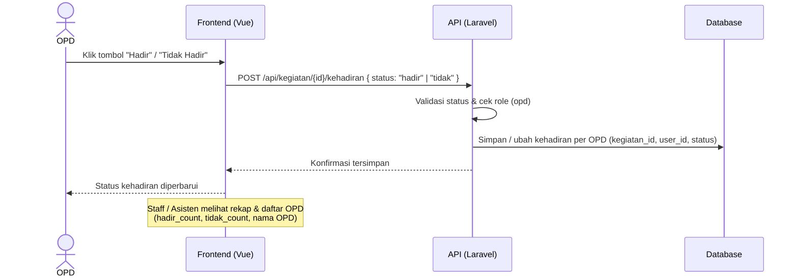
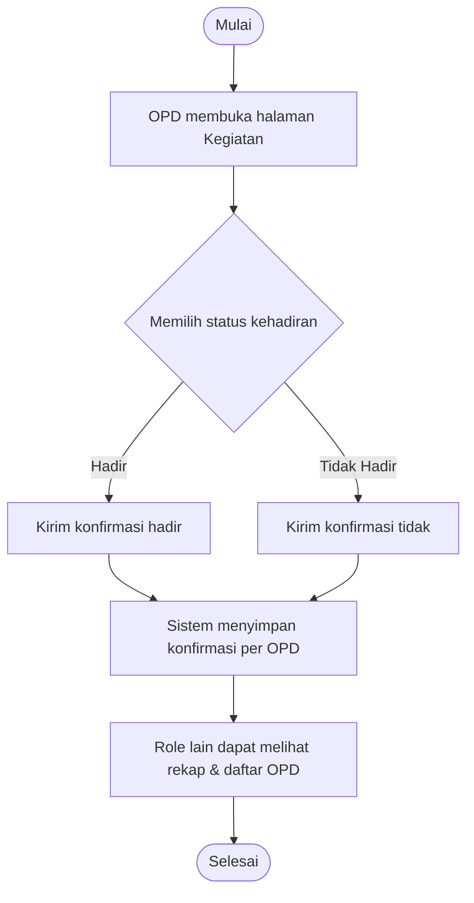
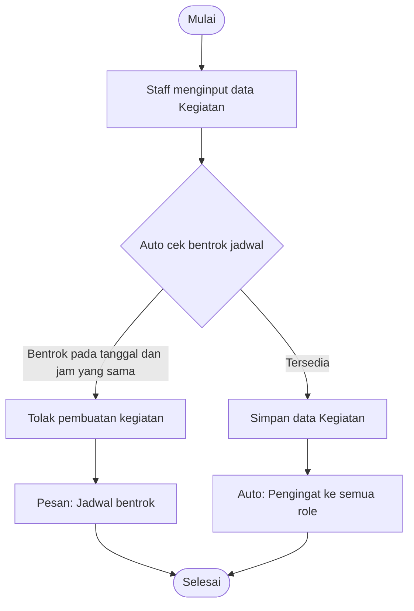
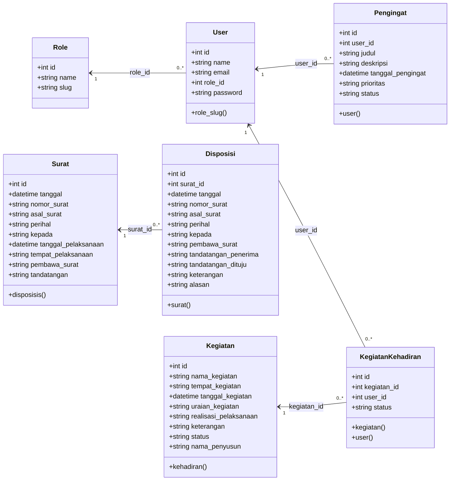

# Dokumentasi UML — SI Pengelolaan Data Agenda

Dokumen ini berisi diagram UML (Use Case, Sequence, Activity, dan Class) untuk sistem **SI Pengelolaan Data Agenda**, aplikasi berbasis **Laravel 12 + Vue 3 (PWA)** untuk mengelola surat, disposisi, kegiatan, kehadiran, dan pengingat.

## Ringkasan Sistem

- **Login** menggunakan email + password (session-based).
- **Role**: `Admin`, `Staff`, `Asisten Daerah`, `OPD`.
- Saat **Staff** membuat **Surat**, sistem otomatis:
  1. Membuat **Disposisi** dengan keterangan `diterima` (tanpa perlu diedit), dan
  2. Membuat **Pengingat** untuk seluruh akun **Asisten Daerah**.
- Saat salah satu role menambah **Kegiatan**, sistem otomatis membuat **Pengingat** untuk **semua role**.
- Saat menambah **Kegiatan**, sistem otomatis melakukan **Cek Bentrok Jadwal**: jika sudah ada kegiatan lain pada tanggal dan jam yang sama, pembuatan kegiatan ditolak.
- Hanya **OPD** yang dapat melakukan **Konfirmasi Kehadiran** kegiatan (`hadir` / `tidak`), tercatat per akun OPD. Role lain dapat melihat rekap dan daftar OPD yang mengonfirmasi.
- **Disposisi** dapat **Diserahkan** atau **Ditolak** (wajib alasan) oleh Asisten Daerah.

## Aktor

| Aktor | Deskripsi |
|-------|-----------|
| **Admin** | Mengelola pengguna & role. |
| **Staff** | Mengelola surat, disposisi, kegiatan, dan pengingat pribadi. |
| **Asisten Daerah** | Meninjau disposisi (menyerahkan/menolak) dan mengelola pengingat pribadi. |
| **OPD** | Mengonfirmasi kehadiran kegiatan dan mengelola pengingat pribadi. |

---

## 1. Use Case Diagram

> Catatan: `<<include>>` menandai proses tambahan yang dijalankan otomatis oleh sistem setelah aksi utama.

---

## 2. Sequence Diagram

### 2.1 Staff Membuat Surat → Auto Disposisi (Diterima) & Pengingat Asisten Daerah

### 2.2 Asisten Daerah Meninjau Disposisi (Serahkan / Tolak)

### 2.3 Staff (atau Role Lain) Menambah Kegiatan → Auto Cek Jadwal & Pengingat Semua Role

### 2.4 OPD Konfirmasi Kehadiran Kegiatan

---

## 3. Activity Diagram

### 3.1 Alur Pengelolaan Surat → Disposisi

### 3.2 Alur Konfirmasi Kehadiran Kegiatan (OPD)

### 3.3 Alur Menambah Kegiatan dengan Auto Cek Bentrok Jadwal

---

## 4. Class Diagram

> Diagram dibuat dengan **Mermaid**. Untuk melihat hasilnya, buka file ini di GitHub, GitLab, VS Code (ekstensi Mermaid), atau tool Markdown yang mendukung Mermaid.

### Nilai Enum / Status

| Atribut | Nilai |
|---------|-------|
| `Disposisi.keterangan` | `diterima`, `ditolak`, `diserahkan` |
| `Kegiatan.realisasi_pelaksanaan` | `terlaksana`, `tidak` |
| `Kegiatan.status` | `pelaksanaan`, `laporan` |
| `KegiatanKehadiran.status` | `hadir`, `tidak` |
| `Pengingat.prioritas` | `rendah`, `sedang`, `tinggi` |
| `Pengingat.status` | `pending`, `selesai` |