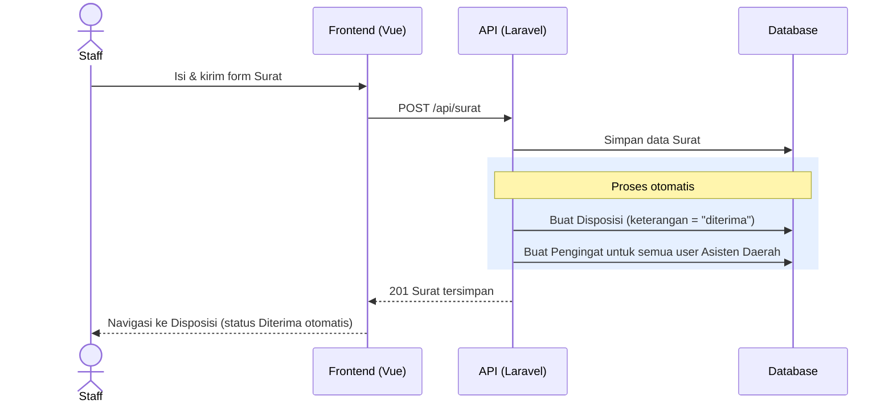
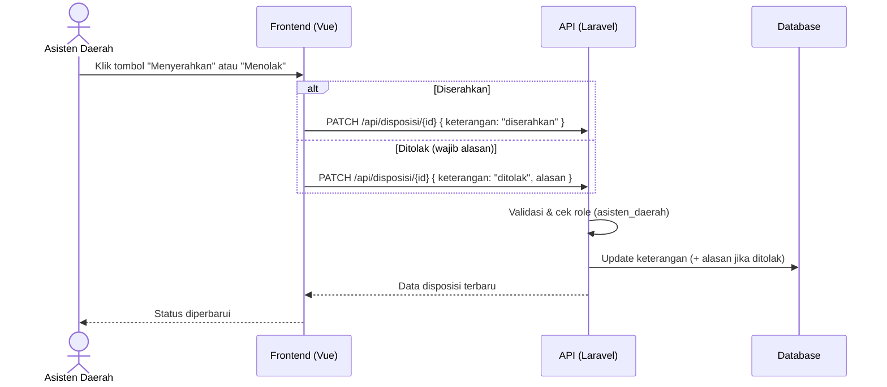
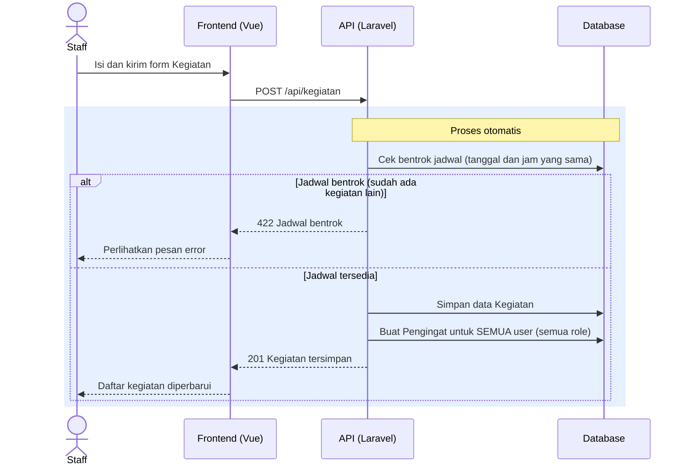
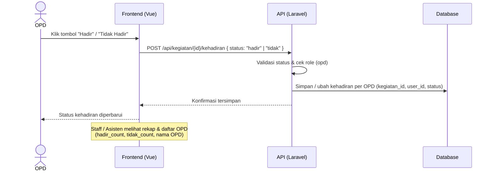
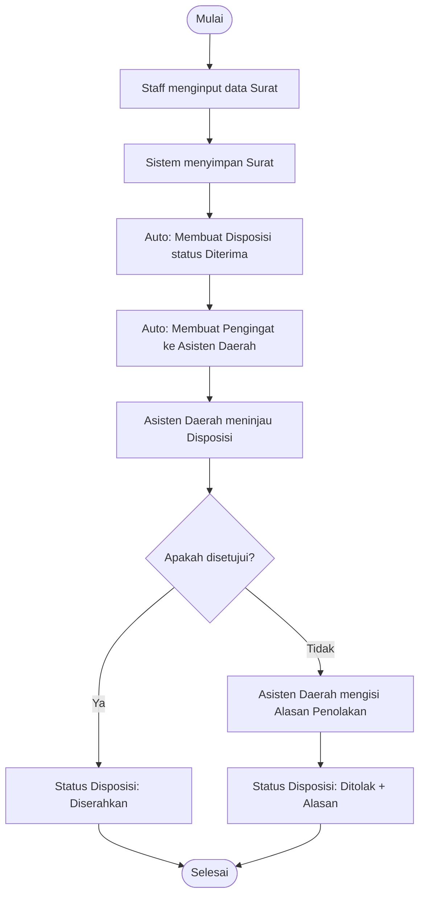
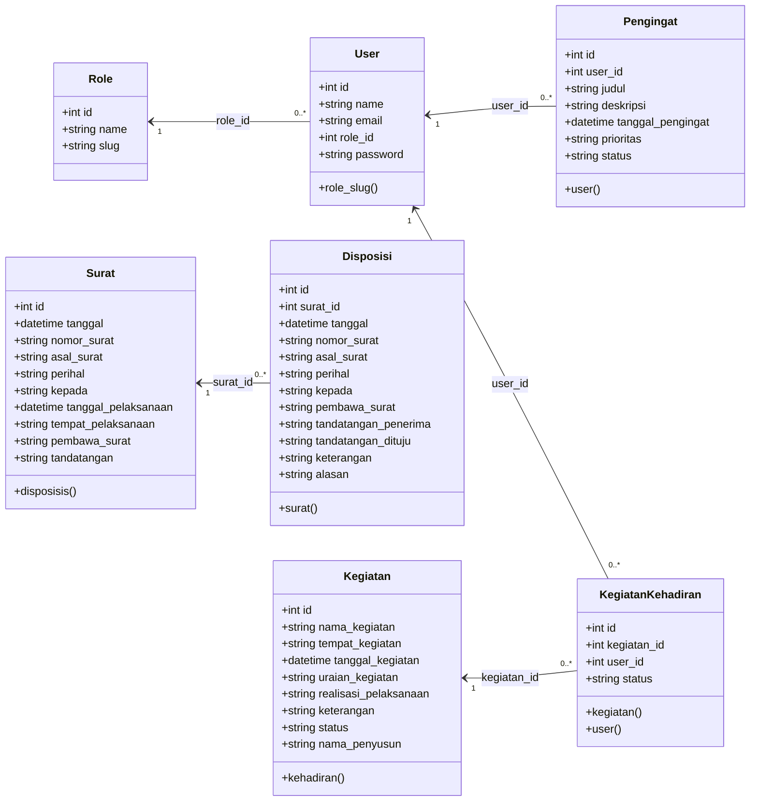

# Dokumentasi UML — SI Pengelolaan Data Agenda

Dokumen ini berisi diagram UML (Use Case, Sequence, Activity, dan Class) untuk sistem **SI Pengelolaan Data Agenda**, aplikasi berbasis **Laravel 12 + Vue 3 (PWA)** untuk mengelola surat, disposisi, kegiatan, kehadiran, dan pengingat.

## Ringkasan Sistem

- **Login** menggunakan email + password (session-based).
- **Role**: `Admin`, `Staff`, `Asisten Daerah`, `OPD`.
- Saat **Staff** membuat **Surat**, sistem otomatis:
  1. Membuat **Disposisi** dengan keterangan `diterima` (tanpa perlu diedit), dan
  2. Membuat **Pengingat** untuk seluruh akun **Asisten Daerah**.
- Saat salah satu role menambah **Kegiatan**, sistem otomatis membuat **Pengingat** untuk **semua role**.
- Saat menambah **Kegiatan**, sistem otomatis melakukan **Cek Bentrok Jadwal**: jika sudah ada kegiatan lain pada tanggal dan jam yang sama, pembuatan kegiatan ditolak.
- Hanya **OPD** yang dapat melakukan **Konfirmasi Kehadiran** kegiatan (`hadir` / `tidak`), tercatat per akun OPD. Role lain dapat melihat rekap dan daftar OPD yang mengonfirmasi.
- **Disposisi** dapat **Diserahkan** atau **Ditolak** (wajib alasan) oleh Asisten Daerah.

## Aktor

| Aktor | Deskripsi |
|-------|-----------|
| **Admin** | Mengelola pengguna & role. |
| **Staff** | Mengelola surat, disposisi, kegiatan, dan pengingat pribadi. |
| **Asisten Daerah** | Meninjau disposisi (menyerahkan/menolak) dan mengelola pengingat pribadi. |
| **OPD** | Mengonfirmasi kehadiran kegiatan dan mengelola pengingat pribadi. |

---

## 1. Use Case Diagram

```mermaid
flowchart TD
    %% ==== Aktor ====
    Admin([Admin])
    Staff([Staff])
    Asisten([Asisten Daerah])
    OPD([OPD])

    subgraph Umum
        UC_LOGIN[Login]
        UC_DASH[Lihat Dashboard]
    end

    subgraph Surat & Disposisi
        UC_SURAT[Kelola Surat: buat / ubah / hapus]
        UC_DISP_EDIT[Kelola Disposisi: ubah / hapus]
        UC_DISP_SERAH[Menyerahkan Disposisi]
        UC_DISP_TOLAK[Menolak Disposisi dengan Alasan]
    end

    subgraph Auto-Proses
        UC_AUTO_DISP((Auto: Buat Disposisi status Diterima))
        UC_AUTO_NOTIF_ASIST((Auto: Pengingat ke Asisten Daerah))
        UC_AUTO_NOTIF_ALL((Auto: Pengingat ke Semua Role))
        UC_AUTO_CEK_BENTROK((Auto: Cek Bentrok Jadwal Kegiatan))
    end

    subgraph Kegiatan & Kehadiran
        UC_KEG_CRUD[Kelola Kegiatan: buat / ubah / hapus]
        UC_KONFIRMASI[Konfirmasi Kehadiran: Hadir / Tidak]
        UC_LIHAT_KEHADIRAN[Lihat Rekap & Daftar OPD]
    end

    subgraph Pengingat
        UC_PENGINGAT[Kelola Pengingat Pribadi]
    end

    subgraph Pengguna
        UC_USER[Kelola Pengguna & Role]
    end

    %% ==== Login & Dashboard semua role ====
    Admin --> UC_LOGIN
    Staff --> UC_LOGIN
    Asisten --> UC_LOGIN
    OPD --> UC_LOGIN

    Admin --> UC_DASH
    Staff --> UC_DASH
    Asisten --> UC_DASH
    OPD --> UC_DASH

    %% ==== Surat & Disposisi ====
    Staff --> UC_SURAT
    UC_SURAT -->|<<include>>| UC_AUTO_DISP
    UC_SURAT -->|<<include>>| UC_AUTO_NOTIF_ASIST

    Staff --> UC_DISP_EDIT
    Asisten --> UC_DISP_SERAH
    Asisten --> UC_DISP_TOLAK

    %% ==== Kegiatan & Kehadiran ====
    Staff --> UC_KEG_CRUD
    UC_KEG_CRUD -->|<<include>>| UC_AUTO_CEK_BENTROK
    UC_KEG_CRUD -->|<<include>>| UC_AUTO_NOTIF_ALL

    OPD --> UC_KONFIRMASI
    Staff --> UC_LIHAT_KEHADIRAN
    Asisten --> UC_LIHAT_KEHADIRAN

    %% ==== Pengingat & Pengguna ====
    Staff --> UC_PENGINGAT
    Asisten --> UC_PENGINGAT
    OPD --> UC_PENGINGAT

    Admin --> UC_USER
```

> Catatan: `<<include>>` menandai proses tambahan yang dijalankan otomatis oleh sistem setelah aksi utama.

---

## 2. Sequence Diagram

### 2.1 Staff Membuat Surat → Auto Disposisi (Diterima) & Pengingat Asisten Daerah

### 2.2 Asisten Daerah Meninjau Disposisi (Serahkan / Tolak)

### 2.3 Staff (atau Role Lain) Menambah Kegiatan → Auto Cek Jadwal & Pengingat Semua Role

### 2.4 OPD Konfirmasi Kehadiran Kegiatan

---

## 3. Activity Diagram

### 3.1 Alur Pengelolaan Surat → Disposisi

### 3.2 Alur Konfirmasi Kehadiran Kegiatan (OPD)

### 3.3 Alur Menambah Kegiatan dengan Auto Cek Bentrok Jadwal

---

## 4. Class Diagram

### Nilai Enum / Status

| Atribut | Nilai |
|---------|-------|
| `Disposisi.keterangan` | `diterima`, `ditolak`, `diserahkan` |
| `Kegiatan.realisasi_pelaksanaan` | `terlaksana`, `tidak` |
| `Kegiatan.status` | `pelaksanaan`, `laporan` |
| `KegiatanKehadiran.status` | `hadir`, `tidak` |
| `Pengingat.prioritas` | `rendah`, `sedang`, `tinggi` |
| `Pengingat.status` | `pending`, `selesai` |

---

## 5. Skenario Pengujian API — Response Berhasil / Gagal

Tabel berikut memetakan setiap use case ke skenario pengujian beserta kode **response HTTP** yang dikembalikan sistem, baik pada kondisi **berhasil** maupun **gagal**. Endpoint API mengembalikan format JSON; endpoint web (login/logout) mengembalikan redirect.

> **Keterangan status:** `200` sukses dengan data, `201` sukses buat data baru, `204` sukses hapus tanpa konten, `302` redirect, `401` belum login, `403` role tidak berhak, `404` data tidak ditemukan, `422` validasi gagal.

### 5.1 Login & Dashboard

| ID | Skenario | Kondisi | Request | Response | Hasil |
|----|----------|---------|---------|----------|-------|
| A-01 | Membuka halaman login | Guest | `GET /login` | `200` | **Berhasil** — form login ditampilkan |
| A-02 | Login | Email & password benar | `POST /login` | `302` | **Berhasil** — redirect ke `/` |
| A-03 | Login | Email/password salah | `POST /login` | `302` + error | **Gagal** — pesan "Email atau password salah" |
| A-04 | Login | Input tidak valid / password lemah | `POST /login` | `302` + error validasi | **Gagal** — error validasi email & kekuatan password |
| A-05 | Login (ingat saya) | Ceklis "remember me" | `POST /login` | `302` + cookie `remember_web_*` | **Berhasil** — sesi diingat |
| A-06 | Logout | User terautentikasi | `POST /logout` | `302` | **Berhasil** — redirect ke `/login` |
| A-07 | Logout | Guest | `POST /logout` | `302` | **Gagal** — redirect ke `/login` |
| A-08 | Akses dashboard `/` | Guest | `GET /` | `302` | **Gagal** — redirect ke `/login` |
| A-09 | Akses dashboard `/` | User terautentikasi | `GET /` | `200` | **Berhasil** — dashboard tampil |

### 5.2 Kelola Surat

| ID | Skenario | Kondisi / Data | Request | Response | Hasil |
|----|----------|-----------------|---------|----------|-------|
| S-01 | Lihat daftar surat | Terautentikasi | `GET /api/surat` | `200` | **Berhasil** — array surat |
| S-02 | Lihat daftar surat | Guest | `GET /api/surat` | `401` | **Gagal** — belum login |
| S-03 | Buat surat | Data valid | `POST /api/surat` | `201` | **Berhasil** — surat tersimpan; auto buat **Disposisi (diterima)** & **Pengingat** ke semua Asisten Daerah |
| S-04 | Buat surat | Field wajib kosong / tanggal tidak valid | `POST /api/surat` | `422` | **Gagal** — error validasi |
| S-05 | Detail surat | Data tersedia | `GET /api/surat/{id}` | `200` | **Berhasil** — data surat |
| S-06 | Detail surat | Data tidak ditemukan | `GET /api/surat/999` | `404` | **Gagal** — surat tidak ada |
| S-07 | Ubah surat | Data valid | `PUT /api/surat/{id}` | `200` | **Berhasil** — data terupdate |
| S-08 | Ubah surat | Field tidak valid | `PUT /api/surat/{id}` | `422` | **Gagal** — error validasi |
| S-09 | Hapus surat | Data tersedia | `DELETE /api/surat/{id}` | `204` | **Berhasil** — data terhapus (tanpa konten) |

### 5.3 Kelola Disposisi (Ubah / Serahkan / Tolak / Hapus)

| ID | Skenario | Kondisi / Data | Request | Response | Hasil |
|----|----------|-----------------|---------|----------|-------|
| D-01 | Lihat daftar disposisi | Terautentikasi | `GET /api/disposisi` | `200` | **Berhasil** — array disposisi |
| D-02 | Lihat disposisi per surat | Filter `?surat_id=` | `GET /api/disposisi?surat_id=5` | `200` | **Berhasil** — hasil terfilter |
| D-03 | Detail disposisi | Data tersedia | `GET /api/disposisi/{id}` | `200` | **Berhasil** — data + relasi surat |
| D-04 | Detail disposisi | Data tidak ditemukan | `GET /api/disposisi/999` | `404` | **Gagal** — disposisi tidak ada |
| D-05 | Staff ubah disposisi | Data valid | `PUT /api/disposisi/{id}` | `200` | **Berhasil** — data terupdate |
| D-06 | Staff ubah (bukan ditolak) | `keterangan != ditolak` | `PUT /api/disposisi/{id}` | `200` | **Berhasil** — `alasan` otomatis dikosongkan |
| D-07 | Staff ubah | Field tidak valid | `PUT /api/disposisi/{id}` | `422` | **Gagal** — error validasi |
| D-08 | Asisten **menyerahkan** | `keterangan = diserahkan` | `PUT /api/disposisi/{id}` | `200` | **Berhasil** — status Diserahkan |
| D-09 | Asisten **menolak** | `keterangan = ditolak` + `alasan` | `PUT /api/disposisi/{id}` | `200` | **Berhasil** — status Ditolak + alasan |
| D-10 | Asisten menolak | Tanpa `alasan` | `PUT /api/disposisi/{id}` | `422` | **Gagal** — alasan wajib diisi saat ditolak |
| D-11 | Asisten memakai field staff | `keterangan = diterima` | `PUT /api/disposisi/{id}` | `422` | **Gagal** — tidak diizinkan untuk role asisten |
| D-12 | Role lain (OPD) ubah | Bukan staff/asisten | `PUT /api/disposisi/{id}` | `403` | **Gagal** — tidak memiliki akses |
| D-13 | Staff hapus disposisi | Data tersedia | `DELETE /api/disposisi/{id}` | `204` | **Berhasil** — data terhapus |
| D-14 | Asisten hapus disposisi | Bukan role staff | `DELETE /api/disposisi/{id}` | `403` | **Gagal** — tidak memiliki akses |

### 5.4 Kelola Kegiatan (Buat / Ubah / Hapus) + Auto Cek Bentrok Jadwal

| ID | Skenario | Kondisi / Data | Request | Response | Hasil |
|----|----------|-----------------|---------|----------|-------|
| K-01 | Lihat daftar kegiatan | Semua role | `GET /api/kegiatan` | `200` | **Berhasil** — daftar + `hadir_count`/`tidak_count` |
| K-02 | Detail kegiatan | Data tersedia | `GET /api/kegiatan/{id}` | `200` | **Berhasil** — data kegiatan |
| K-03 | Detail kegiatan | Data tidak ditemukan | `GET /api/kegiatan/999` | `404` | **Gagal** — kegiatan tidak ada |
| K-04 | **Buat** kegiatan | Staff, jadwal tersedia | `POST /api/kegiatan` | `201` | **Berhasil** — kegiatan tersimpan; auto **Pengingat** ke semua role |
| K-05 | **Buat** kegiatan | Jadwal **bentrok** (tanggal+jam sama) | `POST /api/kegiatan` | `422` | **Gagal** — "Sudah ada kegiatan pada tanggal dan jam tersebut." |
| K-06 | **Buat** kegiatan | Field wajib kosong / tidak valid | `POST /api/kegiatan` | `422` | **Gagal** — error validasi |
| K-07 | **Buat** kegiatan | Role bukan staff (OPD) | `POST /api/kegiatan` | `403` | **Gagal** — tidak memiliki akses |
| K-08 | **Ubah** kegiatan | Staff, jadwal tersedia | `PUT /api/kegiatan/{id}` | `200` | **Berhasil** — data terupdate |
| K-09 | **Ubah** kegiatan | Mengubah ke jadwal **bentrok** | `PUT /api/kegiatan/{id}` | `422` | **Gagal** — jadwal bentrok |
| K-10 | **Ubah** kegiatan | Mempertahankan jadwal sendiri | `PUT /api/kegiatan/{id}` | `200` | **Berhasil** — tidak dianggap bentrok |
| K-11 | **Ubah** kegiatan | Role bukan staff | `PUT /api/kegiatan/{id}` | `403` | **Gagal** — tidak memiliki akses |
| K-12 | **Hapus** kegiatan | Staff | `DELETE /api/kegiatan/{id}` | `204` | **Berhasil** — data terhapus |
| K-13 | **Hapus** kegiatan | Role bukan staff | `DELETE /api/kegiatan/{id}` | `403` | **Gagal** — tidak memiliki akses |

### 5.5 Konfirmasi Kehadiran (OPD)

| ID | Skenario | Kondisi / Data | Request | Response | Hasil |
|----|----------|-----------------|---------|----------|-------|
| H-01 | Konfirmasi **hadir** | Role OPD, `status = hadir` | `POST /api/kegiatan/{id}/kehadiran` | `200` | **Berhasil** — tercatat per akun OPD |
| H-02 | Konfirmasi **tidak hadir** | Role OPD, `status = tidak` | `POST /api/kegiatan/{id}/kehadiran` | `200` | **Berhasil** — status diperbarui |
| H-03 | Ubah konfirmasi | OPD konfirmasi ulang | `POST /api/kegiatan/{id}/kehadiran` | `200` | **Berhasil** — record di-update (bukan duplikat) |
| H-04 | Konfirmasi | `status` tidak valid (bukan hadir/tidak) | `POST /api/kegiatan/{id}/kehadiran` | `422` | **Gagal** — error validasi |
| H-05 | Konfirmasi | Role bukan OPD (staff) | `POST /api/kegiatan/{id}/kehadiran` | `403` | **Gagal** — tidak memiliki akses |
| H-06 | Konfirmasi | Kegiatan tidak ditemukan | `POST /api/kegiatan/999/kehadiran` | `404` | **Gagal** — kegiatan tidak ada |

### 5.6 Kelola Pengingat Pribadi (Staff / Asisten Daerah / OPD)

| ID | Skenario | Kondisi / Data | Request | Response | Hasil |
|----|----------|-----------------|---------|----------|-------|
| P-01 | Lihat daftar pengingat | User melihat data miliknya | `GET /api/pengingat` | `200` | **Berhasil** — hanya pengingat milik sendiri |
| P-02 | Buat pengingat | Data valid | `POST /api/pengingat` | `201` | **Berhasil** — pengingat tersimpan |
| P-03 | Buat pengingat | Field wajib kosong / prioritas tidak valid | `POST /api/pengingat` | `422` | **Gagal** — error validasi |
| P-04 | Detail pengingat | Milik user yang sama | `GET /api/pengingat/{id}` | `200` | **Berhasil** — data pengingat |
| P-05 | Detail pengingat | Milik user lain | `GET /api/pengingat/{id}` | `404` | **Gagal** — diperlakukan sebagai tidak ditemukan |
| P-06 | Ubah pengingat | Milik user yang sama | `PUT /api/pengingat/{id}` | `200` | **Berhasil** — data terupdate |
| P-07 | Ubah pengingat | Milik user lain | `PUT /api/pengingat/{id}` | `404` | **Gagal** — diperlakukan sebagai tidak ditemukan |
| P-08 | Ubah pengingat | Data tidak valid | `PUT /api/pengingat/{id}` | `422` | **Gagal** — error validasi |
| P-09 | Hapus pengingat | Milik user yang sama | `DELETE /api/pengingat/{id}` | `204` | **Berhasil** — data terhapus |
| P-10 | Hapus pengingat | Milik user lain | `DELETE /api/pengingat/{id}` | `404` | **Gagal** — diperlakukan sebagai tidak ditemukan |
| P-11 | Akses pengingat | Role Admin | `GET /api/pengingat` | `403` | **Gagal** — admin tidak diperbolehkan |

### 5.7 Kelola Pengguna & Role (Admin)

| ID | Skenario | Kondisi / Data | Request | Response | Hasil |
|----|----------|-----------------|---------|----------|-------|
| U-01 | Lihat daftar user | Role Admin | `GET /api/users` | `200` | **Berhasil** — daftar user + role |
| U-02 | Buat user | Data valid (password kuat) | `POST /api/users` | `201` | **Berhasil** — user tersimpan |
| U-03 | Buat user | Email sudah terpakai | `POST /api/users` | `422` | **Gagal** — email duplikat |
| U-04 | Buat user | Password lemah | `POST /api/users` | `422` | **Gagal** — password tidak memenuhi syarat |
| U-05 | Detail user | Data tersedia | `GET /api/users/{id}` | `200` | **Berhasil** — data user |
| U-06 | Detail user | Data tidak ditemukan | `GET /api/users/999` | `404` | **Gagal** — user tidak ada |
| U-07 | Ubah user | Data valid | `PUT /api/users/{id}` | `200` | **Berhasil** — data terupdate |
| U-08 | Ubah user | Data tidak valid / role tidak ada | `PUT /api/users/{id}` | `422` | **Gagal** — error validasi |
| U-09 | Hapus user | Menghapus user lain | `DELETE /api/users/{id}` | `204` | **Berhasil** — data terhapus |
| U-10 | Hapus user | Menghapus **akun sendiri** | `DELETE /api/users/{id}` | `422` | **Gagal** — tidak dapat menghapus akun sendiri |
| U-11 | Kelola user | Role bukan Admin (staff) | `GET /api/users` | `403` | **Gagal** — tidak memiliki akses |
| U-12 | Lihat daftar role | Role Admin | `GET /api/roles` | `200` | **Berhasil** — daftar role |
| U-13 | Lihat daftar role | Role bukan Admin | `GET /api/roles` | `403` | **Gagal** — tidak memiliki akses |